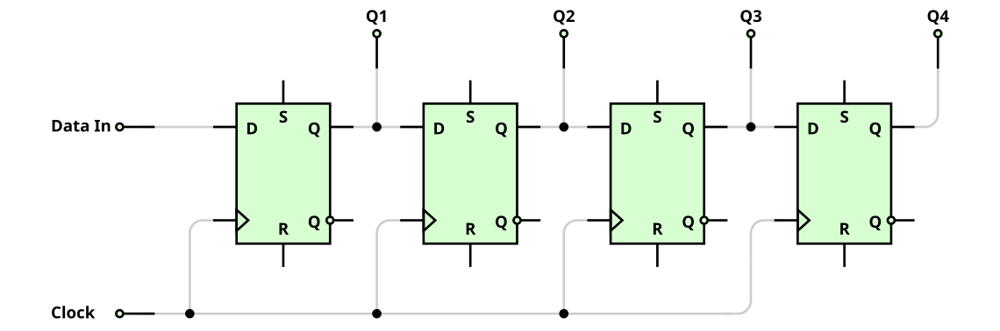

## JS logic memory

Simple JavaScript implementation of D Latch and [SIPO](https://en.wikipedia.org/wiki/Shift_register#Serial-in_parallel-out_(SIPO)) 4 bit register.

#### D Latch
Latch with one D input and one Q output, no syncronization input/clock.

```
     +-----+
     |     |
D ---|     |--- Q
     |     |
     +-----+
```

#### SIPO 



4-bit register that use 4 D-Latch. 

The PISO class implement an input method for serial input that store and shift a bit,
and an output method that return the current value of all the 4 latches in an array.
